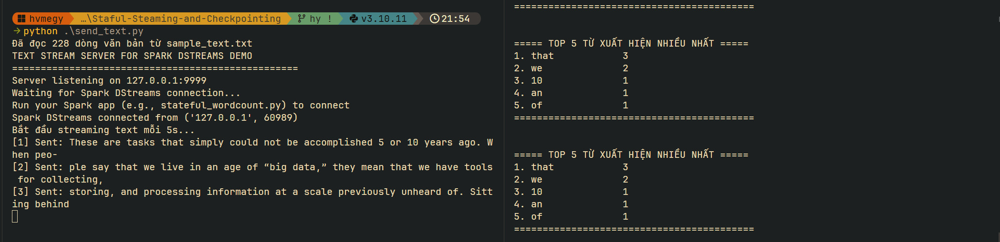

# Staful Steaming and Checkpointing

# Hướng dẫn sử dụng 

1. Dựng cụm Docker Compose Stack: 

```
docker-compose up --build -d
```

2. Chạy file `send_text.py` để chuẩn bị TCP socket server

``` 
python send_text.py
```

3. Xử lý dữ liệu với Spark

``` 
docker exec -it stateful-spark-master /opt/spark/bin/spark-submit /opt/spark-apps/word_count_stateful.py
```

4. Kết quả mong đợi 




5. Dọn dẹp Docker Compose Stack sau khi hoàn thành: 

```
docker-compose down -v 
```

# Luyện tập
