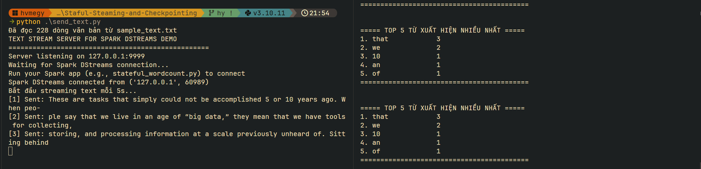
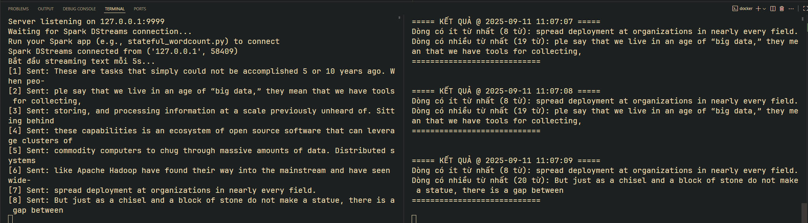
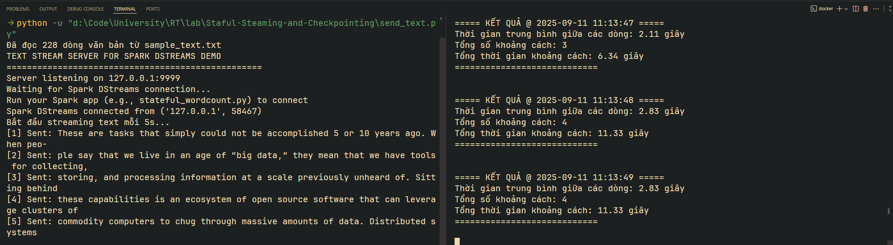

# Staful Steaming and Checkpointing

# Hướng dẫn sử dụng demo

1. Dựng cụm Docker Compose Stack: 

```
docker-compose up --build -d
```

2. Chạy file `send_text.py` để chuẩn bị TCP socket server

``` 
python send_text.py
```

3. Xử lý dữ liệu với Spark

``` 
docker exec -it stateful-spark-master /opt/spark/bin/spark-submit /opt/spark-apps/word_count_stateful.py
```

4. Kết quả mong đợi 



5. Xoá checkpoint 
```
docker exec -it stateful-spark-master bash /opt/spark-apps/clear_tmp.sh
```


6. Dọn dẹp Docker Compose Stack sau khi hoàn thành: 

```
docker-compose down -v 
```

# Luyện tập

1. Minmax 
-  Tìm ra dòng có nhiều từ nhất và ít từ nhất. 
- Hoàn thành file `minmax.py` để xử lý yêu cầu trên. 
- Đầu ra ví dụ: 


```
docker exec -it stateful-spark-master /opt/spark/bin/spark-submit /opt/spark-apps/minmax.py
```

2. Between 
-  Tính thời gian trung bình giữa hai lần gửi liên tiếp. 
- Hoàn thành file `between.py` để xử lý yêu cầu trên. 
- Đầu ra ví dụ: 


```
docker exec -it stateful-spark-master /opt/spark/bin/spark-submit /opt/spark-apps/between.py
```